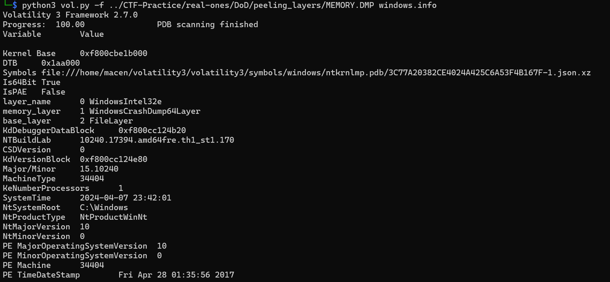
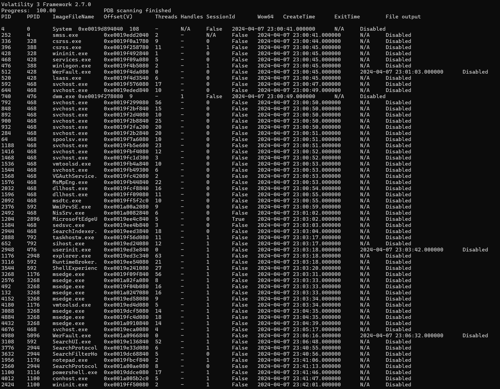
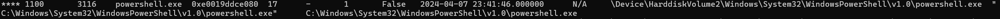
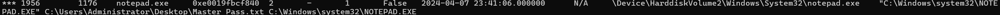
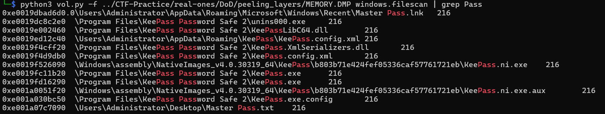
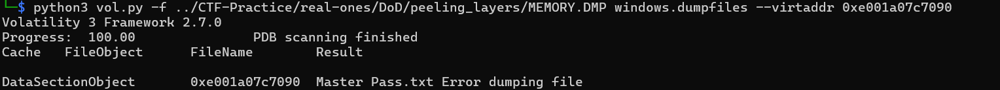
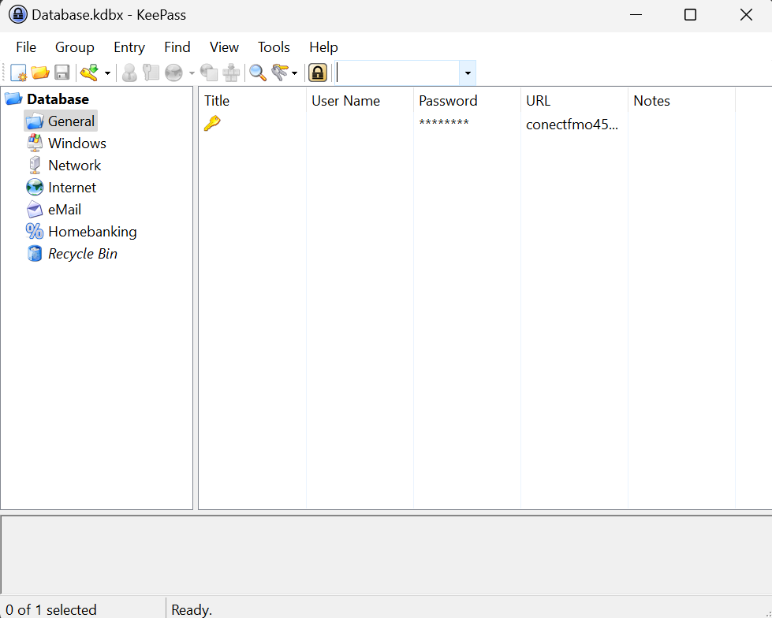
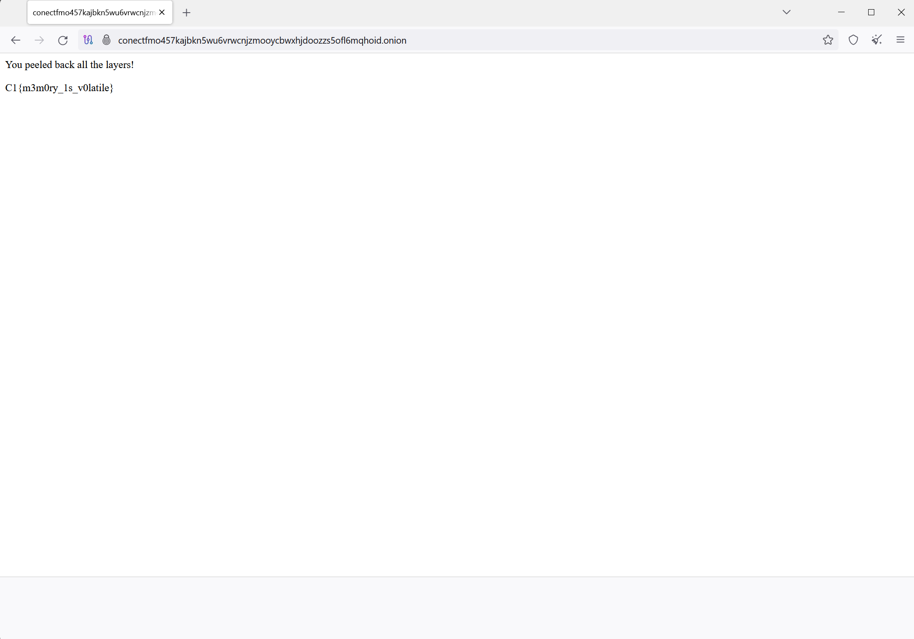

# Peeling Back Layers

I don't remember off the top of my head the exact name, nor the description of this challenge, but they gave us a file called MEMORY.DMP, and told us to find the flag. This challenge was a part of the May 2024 Department of Defense Cyber Sentinels challenge

Starting off, I ran `file` on `MEMORY.DMP`. The name was a good hint, but I wanted to make sure that I got it right. This command returned:
```
MS Windows 64bit crash dump, version 15.10240, 1 processors, full dump, 4992030524978970960 pages
```

So it's a dump of windows memory. This means that the tool of choice is [Volatility](https://github.com/volatilityfoundation/volatility). That's the Volatility2 github repo, and it's what I am most familiar with since I've worked with it before. However, when I ran `imageinfo` on `MEMORY.DMP`, it basically returned that it couldn't find anything. I turned instead to the newer version of [Volatility3](https://github.com/volatilityfoundation/volatility3).

Starting off, let's get some information about our file. The `windows.info` is the Vol3 equivalent to `imageinfo` in Vol2, so we start there:


As we can see, Volatility3 was correctly able to identify our file and parse some basic information about it, which is better than Volatility2 could do, so we're on the right track. Next, we want to run `windows.pslist`, which will return a list of processes running when the capture was taken.


As we can see from that capture, there are a couple things which are of interest to us. First of all, the user has `notepad.exe` running on their computer, which likely means they were accessing and viewing some file that might be useful to us. Second, they are currently running `powershell.exe`, which could return something interesting being run in the command line.

Next, we run `windows.pstree`. This will give us more insight into what exactly is running on each service. Searching through the output for our two processes of interest shows us something about both. First, powershell doesn't seem to have any information here, we'll have to come back to that later

Second, `notepad.exe` has something open, and it looks like a file we would be interested to see!


So now let's take a look at that file. We need to pull it from the memdump with `windows.dumpfiles`, but before we can even do that we need to find it's address in memory. We can do this with the `windows.filescan` command, grepping for our file name.


We see our file at the offset `0xe001a07c7090`. We also see some other files related to Passwords, and a program called KeePass, which is interesting and potentiall useful later. We can now run `windows.dumpfiles`, though, and get the file to read!


Interestingly enough, this throws an error. When you `ls` your directory, however, you can see a file called `'file.0xe001a07c7090.0xe0019ecfa010.DataSectionObject.Master Pass.txt.dat'`, which is the result of this function. I'm not sure what the error was, but it seemed to execute correctly. Catting out this file gives us the contents of 'Master Pass.txt':
```
Keypass DB Master Password: QWNoaW5lc3MzLlJlc2VhcmNoLkRpcmVjdGVk==
```

When we throw this in [CyberChef](https://gchq.github.io/CyberChef/) and convert from base64, it returns our password for whatever keypass is: `Achiness3.Research.Directed`

Okay, so we have a password for something called KeyPass. We saw something called Keepass in the filescan, maybe this is what it's talking about? Looking into it more, it's a password manager, which seems like just the kind of thing we'd be interested in: [https://keepass.info/](https://keepass.info/).

Let's take a look at some of the KeePass files now. We can start with `\Users\Administrator\AppData\Roaming\KeePass\KeePass.config.xml`, since that seems like it would have more information for us. Just like with `Master Pass.txt`, we pull it with `windows.dumpfiles`. When we open up that file, it has a lof of XML information about how KeePass runs! Looking at one of the sections near the bottom, it references a database file:
```xml
<Defaults>
    <OptionsTabIndex>0</OptionsTabIndex>
    <KeySources>
        <Association>
            <DatabasePath>..\..\Users\Administrator\Desktop\Database.kdbx</DatabasePath>
            <Password>true</Password>
        </Association>
    </KeySources>
    <Duplication />
    <Print>
        <MainFont>
            <Family>Microsoft Sans Serif</Family>
            <Size>8.25</Size>
            <GraphicsUnit>Point</GraphicsUnit>
            <OverrideUIDefault>false</OverrideUIDefault>
        </MainFont>
        <PasswordFont>
            <Family>Courier New</Family>
            <Size>8.25</Size>
            <GraphicsUnit>Point</GraphicsUnit>
            <OverrideUIDefault>false</OverrideUIDefault>
        </PasswordFont>
    </Print>
</Defaults>
```

Looking into kdbx files, it's the database file format for KeePass! So if we can get that file and the password, we should be able to take a look at this user's KeePass account! Let's grab this file now. Just like before, we `windows.filescan`, grepping for Database this time. When we find our offset, we pull the database file with `windows.dumpfiles`. Now that we have both, we can rename them from the big `file.*.dat` format into `Master Pass.txt` and `Database.kdbx`. I moved them into my windows Downloads directory, downloaded KeePass, and opened it up! It accepted the database file, and asks for a password! When we put in our Master Pass, it opens up the user's passwords list!!!


This password list only has one password in it, and it's for the website `conectfmo457kajbkn5wu6vrwcnjzmooycbwxhjdoozzs5ofl6mqhoid.onion`. A `.onion` web address means that this is on the dark web! We can open up [Tor Browser](https://www.torproject.org/download/), and navigate to this website to try out the user's password.


We don't even need the password! The website has the flag in plaintext

Flag: `C1{m3m0ry_1s_v0latile}`