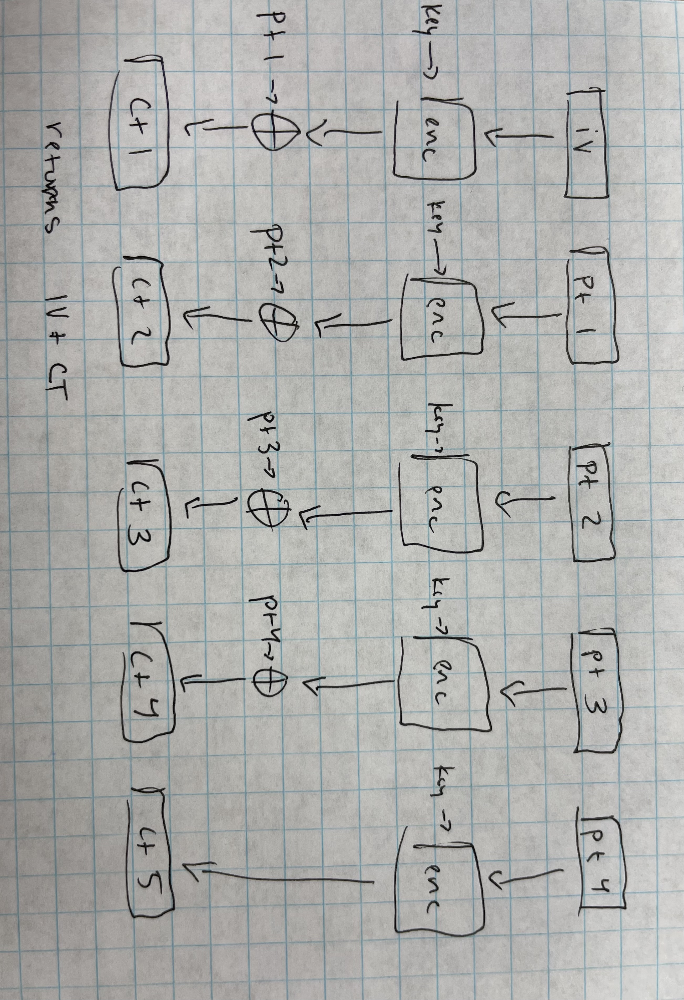
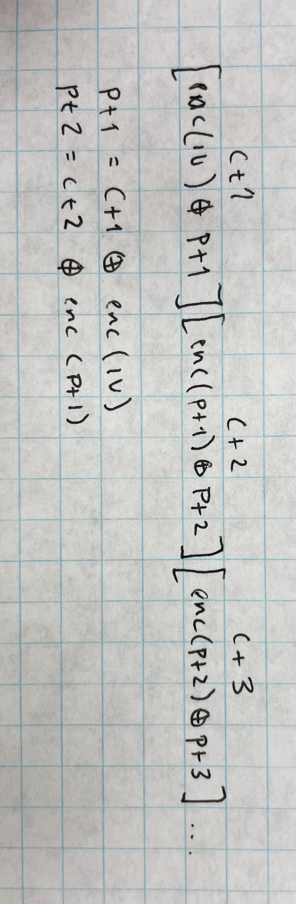

This was a fun challenge. The encryption happened and then an XOR of the plaintext was used on each block except the last, which meant that we could encode one block sections and use them to un-xor the blocks of ciphertext to reveal the plaintext. So submit the original IV, get the resulting one block of ciphertext and XOR it with the first block of the original ciphertext to get the first block of the plaintext. Then recycle that to get another block of ciphertext to XOR and so forth

# Blocked2

### Description

We managed to log into doubledelete's email server. Hopefully this should give us some leads...

nc blocked2.wolvctf.io 1337

Files:
- [server.py](./server.py)

### Solve:

So this challenge is set up as a server that hands you some encrypted text and then gives you the opportunity to encrypt your own message. The setup is very similar to AES-CBC, since it is AES-ECB built in a block cipher. The cipher works by encrypting first the IV and XORing it with the first block of plaintext, then doing the same block by block through the plaintext. Since the plaintext is one block shorter than the IV plus the plaintext, we end up with the last block not being XORed.



The idea for the solve is that if we can find the ciphertext any of the encrypted sections, we can XOR it with the associated block to find each respective component of the flag.



Since the flag generation gives us the original IV, we know the first block of the passed plaintext and just need to encrypt it to get our first block of plaintext. Since the last block of ciphertext is non-XORed, if we pass just one block of plaintext, we should be able to return the raw ciphertext of our IV if we pass it in! I passed a preliminary set of parameters to test my theory:

```py
from Crypto.Util.strxor import strxor

iv = bytes.fromhex("642914f52c44a2a26b86818b51fc59fb")
ct = bytes.fromhex("642914f52c44a2a26b86818b51fc59fbd017ea3f846663db7fbf0532d20efc890c3c43cfaccefdf1487cfebb2833ec88957c54f0043297a1fe8d3be7541d9176f5db393a687c0b0779b860ee899650721033f9121c0b36d4e5444dd7cea6bf10566f4c88d07081cee8660dfadfa5c84517b09816e9f112f67ee4e3cddc5041b36357e83f054df420a0566eabe4cafe659056399911481c1103d78604f3a86f57c5eab55c5b6178d166c81f1293abecbe9b2107559c3c42bb03281bdcf8bcd8906406de785fd725fb769dd6d030b79cec59511b3346ffd224bb47622b02738978b62e83db1a8cd5cbbe2ba5961f660be05af593d4ede634da1d9d6ff77ac0a0741cc1a34cebfe66e3ecc7351bf35748be8df114b45acfea7414d2e0f8525a0e30382974e1b0bf0af153f58f2caad35626")
ecn = bytes.fromhex("073c60638dd100fd8186203bd24e0853a87a8169450b1d1c2fbfded33552578fa47f854ce14614b413c97657b12e92ec")

blocks = [ecn[i:i+16] for i in range(0, len(ecn), 16)]
ctblocks = [ct[i:i+16] for i in range(0, len(ct), 16)]
print(strxor(blocks[2], ctblocks[1]))
```

Now just to run it and cross my fingers!

```sh
overllama@computer:doubledelete$ python3 test.py
b'those wolvsec ne'
```

It worked! So now we just have to write a script to run this on remote, and we should be able to get the flag!

```python
from pwn import *

p = remote('blocked2.wolvctf.io', 1337)
message = b''

p.recvuntil(b'message:\n')

enc_flag = p.recvline().decode()[:-1]
blocks = [enc_flag[i:i+32] for i in range(0, len(enc_flag), 32)]

start = False
for i in range(len(blocks)-1):
    p.recvuntil(b'> ')
    if not start:
        start = True
        p.sendline(blocks[0].encode())
    else:
        p.sendline(message[-16:].hex().encode())
    out = p.recvline().decode()[:-1][-32:]

    pt1 = xor(bytes.fromhex(out), bytes.fromhex(blocks[i+1]))
    message += pt1

print(message)
p.interactive()
```

And it works! this is the full output we get:
`b'those wolvsec nerds really think they\'re "good at security" huh... running the ransomware was way too easy. i\'ve uploaded their files to our secure storage, let me know when you have them\n-doubledelete@wolp.hv\nwctf{s0m3_g00d_s3cur1ty_y0u_h4v3_r0lling_y0ur_0wn_crypt0_huh}\n\x00\x00\x00\x00\x00\x00\x00\x00\x00\x00\x00\x00\x00\x00\x00\x00'`

Flag: `wctf{s0m3_g00d_s3cur1ty_y0u_h4v3_r0lling_y0ur_0wn_crypt0_huh}`